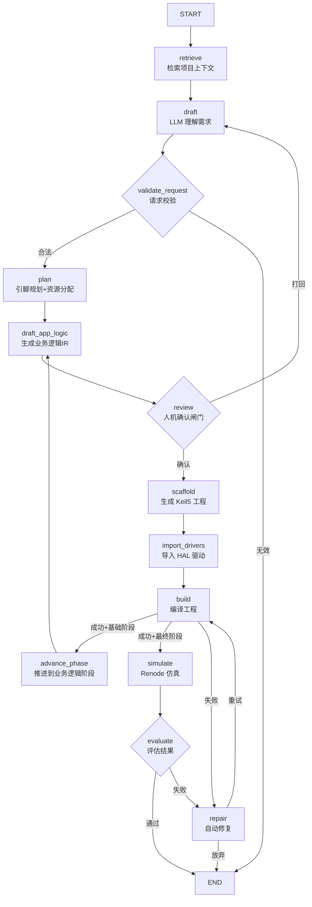

<p align="center">
  <h1 align="center">🔧 ChipWhisper</h1>
  <p align="center"><strong>STM32 智能工程生成 Agent</strong></p>
  <p align="center">从需求描述到可编译 Keil 工程，一键完成</p>
</p>

<p align="center">
  
  
  
  
  
</p>

---

## ✨ 项目简介

ChipWhisper 是一个面向 **STM32** 的工程型 AI Agent，能够将自然语言需求自动转化为可编译的 Keil5 工程，覆盖从引脚规划到业务代码生成的完整链路：

```
需求描述 → 智能规划 → 工程生成 → HAL驱动导入 → 编译验证 → 自动修复
```

**不是** 让大模型随手吐几段 C 代码，**而是** 生成完整的、可编译的、结构规范的 Keil5 工程。

## 🎯 核心能力

| 能力 | 说明 |
|:-----|:-----|
| **智能引脚规划** | 自动分配引脚、检测冲突、处理 I2C/SPI 总线共享 |
| **Keil5 工程生成** | 生成完整的 `.uvprojx` + HAL 初始化 + 模块驱动 |
| **业务逻辑生成** | LLM 驱动的 `app_main.c` 生成，带代码片段约束 |
| **两阶段编译** | 先编译硬件层，验证通过后再生成业务逻辑 |
| **自动修复** | 编译错误自动分类 + API 上下文注入修复 |
| **扩展包机制** | 通过 `packs/` 灵活扩展芯片、板卡、模块 |

## 📦 支持的硬件

### 芯片
- **STM32F103** (C8T6 / RBT6)
- **STM32G431** (RBT6) — 蓝桥杯竞赛平台

### 板卡
- CT117E (蓝桥杯官方开发板)
- 通用最小系统板

### 模块库 (49+)

<details>
<summary>点击展开完整模块列表</summary>

| 类别 | 模块 |
|:-----|:-----|
| **传感器** | AHT20, DHT11, DS18B20, SHT30, BH1750, MPU6050, MQ-2, MLX90614, HC-SR04, INA219 |
| **显示** | SSD1306 OLED, LCD1602 I2C, CT117E LCD, TM1637, LED阵列 |
| **通信** | ESP8266 WiFi, HC-05 蓝牙, UART帧协议 |
| **执行器** | 直流电机PWM, 28BYJ-48步进电机, SG90舵机, 继电器, 有源/无源蜂鸣器 |
| **存储** | AT24C02/C32 EEPROM, 持久化设置 |
| **输入** | 4键/矩阵键盘, 红外遥控(NEC), RFID RC522, 指纹AS608 |
| **时钟** | DS1302, DS1307, DS3231 |
| **算法** | PID控制器, 移动平均滤波, 环形缓冲区 |
| **IO扩展** | 74HC573, 74HC595, PCF8574, MCP23017 |

</details>

## 🧠 LangGraph 工作流

ChipWhisper 使用 [LangGraph](https://github.com/langchain-ai/langgraph) 编排完整的工程生成流程，支持人机交互确认、自动修复循环和两阶段增量编译：



### 两阶段增量生成

```
第一阶段 (infrastructure)          第二阶段 (app_logic)
┌──────────────────────┐           ┌──────────────────────┐
│  HAL 初始化代码       │    ──→    │  业务逻辑 app_main.c  │
│  外设驱动文件         │  编译通过  │  状态机 / 任务调度     │
│  引脚宏定义           │  后推进    │  传感器采集 / 显示     │
└──────────────────────┘           └──────────────────────┘
```

先编译验证硬件层，确保基础代码无误后，再在其上生成业务逻辑。大幅降低复杂项目的编译失败率。

### 自动修复闭环

编译失败时，`repair` 节点会：

1. **错误分类** — 识别 `missing #include`、`undefined symbol`、`type mismatch` 等常见模式
2. **API 上下文注入** — 从项目头文件中提取函数原型，作为修复参考
3. **LLM 结构化修复** — 生成 `search/replace` 补丁，白名单校验后应用
4. **有限重试** — 最多 3 轮自动修复，失败则回退人工复核

## 🛠️ 技术特性

### 代码片段约束 (Snippets)

每个模块附带经过验证的 `app_logic_snippets`，包含 **init / loop / API 摘要**，LLM 生成代码时被强制引用这些片段，避免编造不存在的 API：

```json
{
  "app_logic_snippets": {
    "init": "AHT20_Init(&hi2c1);",
    "loop": "AHT20_Read(&hi2c1, &temperature, &humidity);",
    "api_summary": "AHT20_Init(hi2c) AHT20_Read(hi2c, &temp, &hum)",
    "notes": "Call AHT20_Read every 2+ seconds."
  }
}
```

### 场景模板匹配 (Scenarios)

11 个预定义场景模板（含 6 个蓝桥杯真题），系统根据请求中的模块组合自动匹配最佳场景，为 LLM 提供完整的需求上下文：

```
request.json → match_scenarios() → 匹配 "temp_humidity_display" 场景
                                  → 注入 LCD 显示格式 + 采集周期 + 阈值逻辑
```

### 算法 Pack

PID 控制器、移动平均滤波、环形缓冲区等算法模块提供 **验证过的 C/H 模板**，直接复制到工程中，不依赖 LLM 生成：

| 算法 | 文件 | 特性 |
|:-----|:-----|:-----|
| PID Controller | `pid.c/h` | 抗积分饱和、运行时调参 |
| Moving Average | `moving_avg.c/h` | 可配置窗口大小 |
| Ring Buffer | `ring_buffer.c/h` | 线程安全、零拷贝 |

### 模块驱动模板

7 个高频模块提供完整的 C/H 驱动模板，基于真实数据手册编写：

| 模块 | 协议/接口 | 参考来源 |
|:-----|:---------|:---------|
| 28BYJ-48 步进电机 | GPIO (ULN2003) | 28BYJ-48 datasheet |
| DS18B20 温度传感器 | One-Wire | Maxim DS18B20 datasheet |
| ESP8266 WiFi | UART AT 指令 | Espressif AT Instruction Set v3.0 |
| HC-05 蓝牙 | UART SPP | HC-05 AT Command Set |
| MQ-2 烟雾传感器 | ADC | MQ-2 datasheet Rs/Ro 曲线 |
| Active Buzzer | GPIO | 通用有源蜂鸣器模块 |
| IR Receiver | EXTI (NEC) | NEC IR Protocol Spec |

### AppLogicIR 中间表示

业务逻辑通过结构化 IR (中间表示) 描述，而非直接生成 C 代码，支持：

- **类型定义** — `enum` 和 `struct`
- **宏定义** — `#define` 常量
- **全局变量** — 带初始值和注释
- **辅助函数** — `helpers` 内联声明
- **状态机** — 状态/转移/超时/重试计数
- **定时任务** — 周期执行 + 事件触发
- **验收条件** — 串口输出关键字检查

## 🚀 快速开始

### 环境要求

- Python 3.10+
- [Keil MDK-ARM 5](https://www.keil.com/mdk5/) — 编译 STM32 工程
- [STM32CubeMX](https://www.st.com/stm32cubemx) — 芯片引脚配置 + HAL 驱动包管理
- [Renode](https://renode.io/) — 可选，仿真验证（无需实体硬件）

> 💡 安装后需配置路径，参考 `stm32_agent.paths.example.json`：
> ```json
> {
>   "keil_uv4_path": "D:\\Keil_v5\\UV4\\UV4.exe",
>   "stm32cubemx_install_path": "D:\\STM32CubeMX",
>   "stm32cube_repository_path": "C:\\Users\\你的用户名\\STM32Cube\\Repository",
>   "renode_exe_path": "D:\\Renode\\renode.exe"
> }
> ```

### 安装

```bash
git clone https://github.com/yourname/ChipWhisper.git
cd ChipWhisper
pip install -r requirements-desktop.txt
```

### 一键生成工程

```bash
# 从 request.json 一键生成可编译的 Keil5 工程
python -m stm32_agent generate request.json ./output
```

### 分步使用

```bash
# 1. 规划引脚和资源
python -m stm32_agent plan request.json

# 2. 生成 Keil5 工程
python -m stm32_agent scaffold request.json ./output

# 3. 导入 HAL 驱动
python -m stm32_agent import-cubef1-drivers ./output

# 4. 编译工程
python -m stm32_agent build-keil ./output
```

### 桌面端 (GUI)

ChipWhisper 提供基于 **PySide6** 的桌面工作台，深色 IDE 风格界面：

```bash
# 安装桌面依赖
pip install -r requirements-desktop.txt
# 或使用 conda
conda env create -f environment.yml && conda activate stm32-agent

# 启动桌面端
python -m stm32_agent.desktop
```

桌面端功能：

| 页面 | 功能 |
|:-----|:-----|
| **工作台** | 编辑 request JSON → 规划 → 生成 → 编译 → 导出 HEX，一站式操作 |
| **对话** | 自然语言对话，支持 OpenAI / Ollama 流式输出，可附带 PDF/DOCX/图片 |
| **项目** | 浏览生成工程目录、预览源码、查看 project_ir.json |
| **配置** | 管理 Keil/CubeMX/Renode 路径 + LLM 模型 Profile + 连接测试 |

### 请求文件示例

```json
{
  "summary": "温湿度采集并显示在OLED屏幕上，超过阈值蜂鸣器报警",
  "chip": {"name": "STM32F103C8T6"},
  "modules": [
    {"kind": "aht20_i2c", "name": "sensor"},
    {"kind": "ssd1306_i2c", "name": "oled"},
    {"kind": "active_buzzer", "name": "buzzer"}
  ],
  "requirements": [
    "每2秒采集温湿度",
    "OLED显示温度和湿度",
    "温度超过30度蜂鸣器报警"
  ]
}
```

## 🏗️ 项目结构

```
ChipWhisper/
├── stm32_agent/           # 核心 Agent 代码
│   ├── graph/             # LangGraph 工作流（两阶段生成+自动修复）
│   ├── templates/         # Jinja2 工程模板
│   ├── catalog.py         # 内置芯片/模块目录
│   ├── planner.py         # 引脚规划器
│   ├── keil_generator.py  # Keil5 工程生成器
│   ├── app_logic_ir.py    # 业务逻辑中间表示
│   ├── app_logic_drafter.py # LLM 业务代码生成
│   ├── cli.py             # CLI 命令入口
│   └── ...
├── packs/                 # 扩展包
│   ├── modules/           # 49+ 模块定义和驱动模板
│   └── scenarios/         # 11 场景模板（含蓝桥杯真题）
├── tests/                 # 测试用例 (188 passed)
├── docs/                  # 设计文档
└── README.md
```

## 🏆 蓝桥杯竞赛支持

内置 6 个蓝桥杯高级场景模板，基于真题资料：

| 场景 | 考点 |
|:-----|:-----|
| ADC采集+PWM输出 | R37/R38电位器，4/8kHz频率切换 |
| 串口协议解析 | 自定义帧格式，状态机解析 |
| 频率测量+信号发生 | PA7输入捕获，PA1 PWM输出 |
| RTC时钟+EEPROM | 内部RTC + AT24C02掉电保存 |
| 双ADC阈值监控 | 双通道独立阈值，联动报警 |
| 国赛级综合 | ADC+PWM+UART+EEPROM+RTC 全覆盖 |

## ⚙️ CLI 命令

| 命令 | 说明 |
|:-----|:-----|
| `generate` | **一键流程**：plan → scaffold → import → build |
| `plan` | 规划引脚和资源分配 |
| `scaffold` | 生成 Keil5 工程骨架 |
| `build-keil` | 调用 Keil 编译工程 |
| `build-project` | 自动检测并编译 |
| `doctor-packs` | 检查扩展包完整性 |
| `init-packs` | 初始化扩展包目录 |
| `import-cubef1-drivers` | 导入 STM32F1 HAL 驱动 |
| `import-cubeg4-drivers` | 导入 STM32G4 HAL 驱动 |
| `simulate-renode` | Renode 仿真验证 |

## 🧪 测试

```bash
python -m pytest tests/ -q
# 188 passed ✅
```

## 🔧 LLM 配置

复制配置模板并填入 API Key：

```bash
cp stm32_agent.llm.example.json stm32_agent.llm.json
```

支持 OpenAI / Azure / 本地兼容 API。

## 📖 文档

- [架构设计](docs/architecture.md)
- [LangGraph 工作流](docs/langgraph_workflow.md)
- [扩展包机制](docs/extension_packs.md)
- [蓝桥杯支持](docs/lanqiao_support.md)
- [CT117E-G431 适配](docs/ct117e_g431_support.md)
- [路径配置](docs/path_configuration.md)

## 🎓 适用场景

- ✅ STM32 课程设计和实验
- ✅ 蓝桥杯嵌入式竞赛备赛
- ✅ 毕业设计快速原型
- ✅ 常见模块项目快速起步
- ⚠️ 需要 RTOS 的复杂项目（暂不支持）
- ⚠️ 图像处理/USB 设备类项目（暂不支持）

## 📄 License

MIT License
